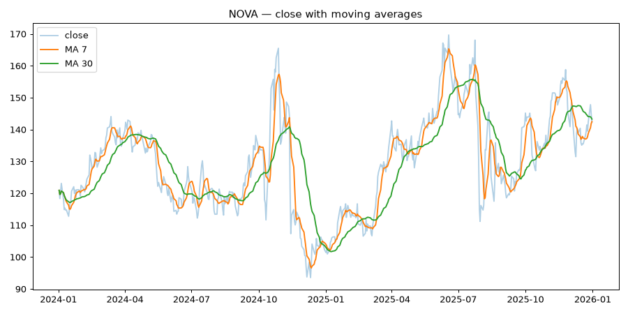
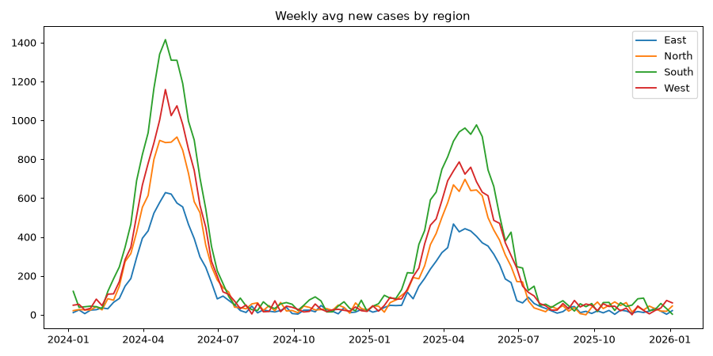
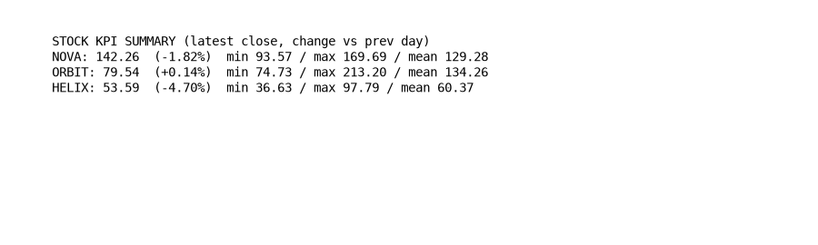

# Interactive Data Visualization Dashboard

Turn raw datasets into consumer insights: KPI cards, interactive trend
charts, moving averages, volatility views, and CSV export — all in the
browser via Streamlit.

## Features

- **Two bundled datasets** — synthetic stock prices (3 tickers, 2 years)
  and public-health time series (4 regions, daily cases/hospitalizations)
- **Bring your own data** — upload any CSV with a date column
- **Interactive filters** — date-range slider, group multiselect,
  daily/weekly/monthly granularity, moving-average overlays
- **KPIs** — latest value, change vs previous period, min/max/mean
- **Views** — trend lines, per-group breakdowns, volatility (stocks)
  or 7-day rolling averages (health), per-100k normalization
- **Export** — download the filtered slice as CSV

## Example outputs

Rendered from the bundled sample datasets:





## Quickstart

```bash
python -m venv .venv && source .venv/bin/activate
pip install -r requirements.txt

# generate the sample datasets (first run only)
python src/data_gen.py

# launch
streamlit run app.py
```

Then open the URL Streamlit prints (usually http://localhost:8501).

## Tests

```bash
python -m unittest discover -s tests -v
```

## Layout

```
app.py            # Streamlit dashboard
src/
  analytics.py    # moving averages, returns, resampling, KPI summaries
  data_gen.py     # synthetic sample-dataset generator
data/             # generated CSVs (gitignored)
tests/
```

## Notes

Sample datasets are synthetic — realistic shapes, made-up numbers. They
exist so the dashboard works out of the box; swap in real data via the
Upload CSV option for actual analysis.
